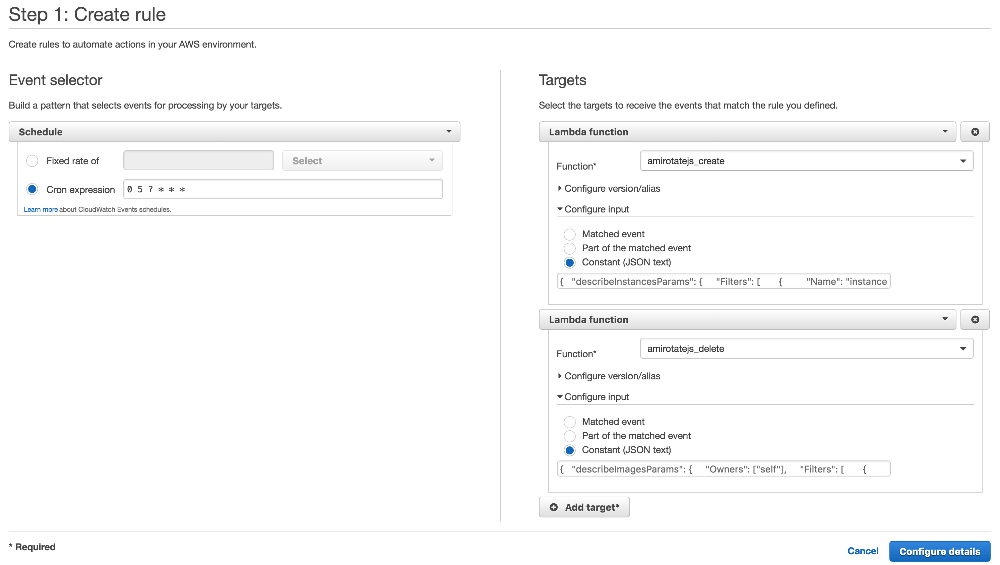

# amirotate.js

Lambda functions to rotate AMIs of EC2 instance.

## Usage

### Create an IAM Role for Lambda functions

Create an IAM Role with principal of Lambda and name it `amirotatejs`.

```json
{
  "Version": "2012-10-17",
  "Statement": [
    {
      "Effect": "Allow",
      "Principal": {
        "Service": "lambda.amazonaws.com"
      },
      "Action": "sts:AssumeRole"
    }
  ]
}
```

And attach policy below.

```json
{
  "Version": "2012-10-17",
  "Statement": [
    {
      "Sid": "Stmt1464584150000",
      "Effect": "Allow",
      "Action": [
        "ec2:CreateImage",
        "ec2:CreateTags",
        "ec2:DeleteSnapshot",
        "ec2:DeregisterImage",
        "ec2:DescribeImages",
        "ec2:DescribeInstances",
        "ec2:DescribeSnapshots",
        "ec2:DescribeTags",
        "logs:CreateLogGroup",
        "logs:CreateLogStream",
        "logs:PutLogEvents"
      ],
      "Resource": [
        "*"
      ]
    }
  ]
}
```

### Deploy Lambda Functions

Clone repo.

```sh
$ git clone https://github.com/y13i/amirotatejs.git
```

Install dependencies.

```sh
$ cd amirotatejs
$ npm install
```

Replace `role` on `project.json` with your IAM Role ARN.

```json
  "role": "arn:aws:iam::<REPLACE WITH YOUR AWS ACCOUNT NUMBER>:role/amirotatejs",
```

Deploy. (Note: IAM Policy above is for functions, so you need different policy this time)

```sh
$ npm run deploy
```

### Tag instances

If you want to change target instances to tag, edit `describeInstancesParams` on `events/tag.json` with [`Filters` or `InstanceIds` in manner of JavaScript SDK](http://docs.aws.amazon.com/AWSJavaScriptSDK/latest/AWS/EC2.html#describeInstances-property).

Also, you can change amirotate.js settings now. `opts.retention_period` should defined in unit of seconds.

And execute.

```sh
$ npm run tag
```

### Try `create` function

```sh
$ npm run create
```

### Set Scheduled Event

Go to CloudWatch Management Console and set scheduled event source to invoke `amirotatejs_create` and `amirotatejs_delete`.

Event input should be constant JSON. Copy and paste `events/create.json` and `events/delete.json`.

Like this.



## See also

- [Apex – Serverless Infrastructure](http://apex.run/)
- [手っ取り早く ES2015 で Lambda Function を書く - Qiita](http://qiita.com/y13i/items/fb90858cdede3eb4dbdf)
